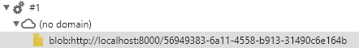

# Workerify - Step 3

In the third step, we generate a real worker from our function using the File API.

## Usage

Browsers usually don't allow web pages to load local content (unless you explicitely check the option), which is why you'll need a local http(s) server to serve content. The simplest way to do it is probably with Python :
- open a bash in the git directory
- Python 3 : ``python -m http.server``
- Python 2 : ``python -m SimpleHTTPServer``

Then open a local page on ``http://localhost:8000/``.

## State at step 3

 We'll now use the powerful File API to automatically generate our worker. For this, we'll use ``Function.prototype.toString`` and a ``Blob``. If you're not familiar with Blobs, feel free to read [the MDN Documentation](https://developer.mozilla.org/en-US/docs/Web/API/Blob). You can also see a simplified example on [this commit](https://github.com/acouderc/toys/commit/c274dd9dde724329d0181d48fa19c026eafe3c97).

Using this and ``URL.createObjectURL`` - if you used ``fetch`` already, in the same manner fetched images are inserted -, we can dynamically create our worker.

However, we have a (somewhat) big problem : toString doesn't preserve context (here, closures) ! So ``func`` doesn't refer to anything. As a naive solution, we'll hardcode a ``func`` var and it will work. However, this doesn't really solve the problem and we'll come back to it.
